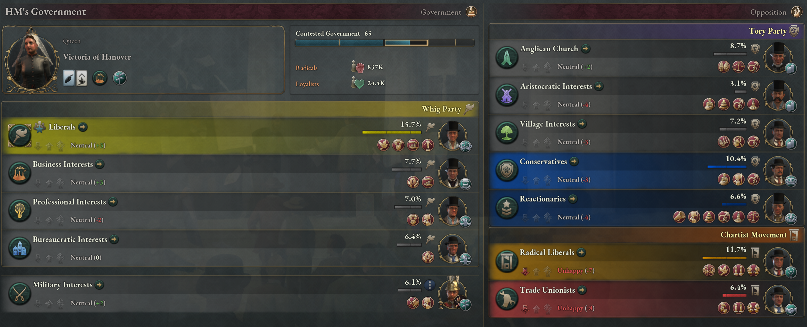

# Better Politics Mod
 ***Playtesters wanted!*** DM me on Discord: `lilliesea#8032`

 A mod for the strategy game Victoria 3 that expands political mechanics, introducing more interest groups and interest group splits.

 Thanks to AcrillicTuna's [Interest Group Descriptions](https://steamcommunity.com/sharedfiles/filedetails/?id=2898602048) mod for better tooltips :)

 
 
## Installation
 For Windows: Place the `better-politics-mod` folder into your Victoria 3 mod folder. This is probably something like: `C:\Users\<username>\Documents\Paradox Interactive\Victoria 3\mod` if the game was installed with default settings.
 
## New Interest Groups
 The interest groups (IGs) in this mod come in two categories: non-ideological and ideological. The intent is to model politics in its varied forms, from non-ideological squabbles between institutional power blocs, to ideological movements led by disciplined mass parties. 
 
 Vanilla Vicky 3, as of writing, sort of attempts to do this, but its IGs and ideologies are mixed up and flattened to be either static or wholly arbitrary. Why are petite-bourgeois professionals inherently reactionary? Why do all intellectuals switch from socialism to nationalism at the drop of a hat? None of it makes sense, really. A better model would be, for instance, to have liberals and reactionaries jockey for power among largely non-ideological professional associations, and to have academics spread out among different ideologies.
 
 ### Non-ideological Interest Groups
 These IGs represent the interests of ossified institutions. While they can align themselves with a cause, their main goal is simply to maximize their influence. As such, unless faced with a serious crisis, they are inherently (small-c) conservative. *Under the hood, these are just reskinned vanilla IGs, so this mod is minimally compatible with any vanilla IG events.*
 
- **Village Interests**: A non-ideological power bloc representing the diverse interests of rural folk and local powerbrokers. While often incoherent, such village interests are generally aligned towards local autonomy and traditional values.
- **Business Interests**: A non-ideological power bloc representing the interests of big businesses. Generally committed to limiting government oversight, on all other issues they side with whatever benefits monopoly capital at any moment.
- **Aristocratic Interests**: A non-ideological power bloc representing the interests of traditionally powerful families. Generally committed to preserving their power, they are plagued by squabbles over ancient grudges. 
- **Bureaucratic Interests**: A non-ideological power bloc representing entrenched bureaucrats. These corrupt officials are experts at manipulating political machines to stay in power, despite intended political processes.
- **Professional Interests**: A non-ideological power bloc representing the interests of professionals and merchants. Typically organized into professional associations, craft unions, traditional guilds, and informal cartels, these groups fear encroachment from big businesses as well as the unwashed masses. Examples range from Dutch and Italian merchant guilds to the American Federation of Labor.
- **Military Interests**: A non-ideological power bloc representing the military top brass. Generally committed to expanding military power over civil society, they seek personal prestige and enrichment through military office.
- **Church Interests**: A non-ideological power bloc representing organized religion as an entrenched institution. Its members differ from religious moralists as they seek to preserve their privileges within religious structures, rather than injecting religion into broader politics. In countries without a strong organized religion, these are local clerics who hold wealth or secular influence. Examples include state churches, Sunni Muftis, and the local ritual masters of China.

### Ideological Interest Groups
 These IGs represent those that adhere to a specific ideology, and usually have a broad vision for society. For the ideological IGs to grow, you need some degree of urbanization and literacy, so these will begin weak in most countries and grow in power over time. In future updates, these IGs will also suffer crises via event chains, and either emerge united or split into several different IGs.

 
#### Liberals
 - **Radical Liberals** take the ideals of their moderate cousins to their logical end. They agitate for full democracy and social egalitarianism, resorting to revolutionary means where official politics is impossible. As such, they may overlap with socialists early on, though they would grow more moderate over time. Examples include the French Radicals, the 1848 revolutionaries, American Radical Republicans, and Sun Yat-sen's KMT.
 - **Liberals** wish to reform the state to embrace Englightenment ideals. They usually advocate for laissez-faire economics and civil rights, within a strong nation-state separate from traditional power structures. Examples include the British Whigs, American Republicans, and Russian Kadets.
 - **Conservatives** refer to the broad set of people who want to preserve the status quo, while situationally advancing or rolling back reforms in response to societal crises. Since this is not a unified ideology, conservatives can be rife with internal conflicts, for instance, between those who support libertarianism vs. social paternalism, particularism vs. nationalism, or secularism vs. religious moralism.

#### Left
 - **Trade Unionists** center their activity on trade unions rather than parties or the government, coordinating strikes and collective bargaining to maintain workers' power against employers. Typically eschewing political goals for economic ones, they will participate in general politics only in specific circumstances. Organized examples include the American CIO and the British TUC.
 - **Socialists** refer to the broad tradition of leftists that oppose the anarchists in the First International. Specific tendencies can vary greatly, for instance, between the mass movement of the British Chartists, the secret societies of the Blanquists, the parliamentary politics of Lassalleans, and the scientific socialism of Marxists.
 - **Anarchists** are socialists that believe in the immediate abolition of the state. Varied in specific beliefs, anarchists usually follow the tradition of Proudhon and Bakunin against other types of socialism, attempting to form non-hierarchical labor alliances seeking to either outgrow the state or overthrow it in one fell swoop.
- **Agrarian Populists** do not come from a single tradition, and can vary greatly even within one country. Generally, they oppose established landowners in favor of egalitarian land use; moderate populists seek local autonomy and tax reform, whereas more radical ones advocate for social revolution. Examples include the Russian Narodniki and the American Populist Party.

#### Right
 - **Reactionaries** are a broad tent of those who want to go back to the good old days, who unlike niche interest groups elevate their nostalgia to a general politics. The specifics of what they want depends on what the good old days were like (or seemed to be) in each particular country. Subsections of this group include monarchist absolutists, noblemen, religious moralists, or even wealthy peasants.
 - An extreme-right ideology, **fascism** is difficult to define in specific terms. Generally characterized by national chauvinism, a reverence of the state, and a rabid hostility to any Left-wing or perceived foreign elements, it is just as much inundated with contradictions -- while fascists often espouse deeply traditional values, they also glorify the efficiency of modern industry and war. This strange coupling of traditionalism with modernity is what sets e.g. clerical fascism apart from traditional moralism, and Italian Futurism apart from socialism.
